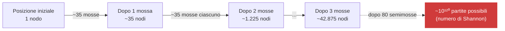
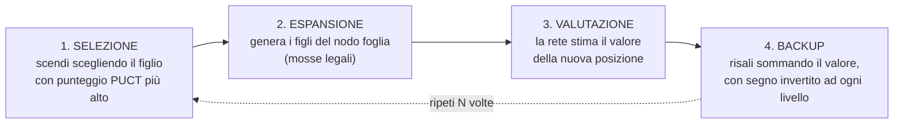
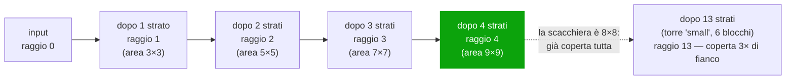
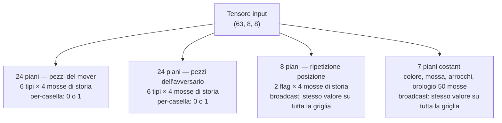
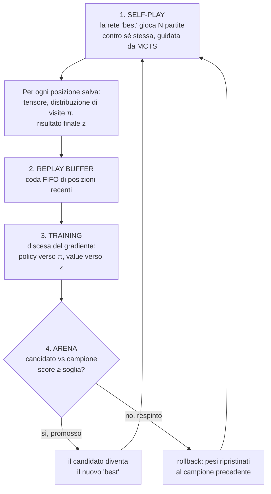
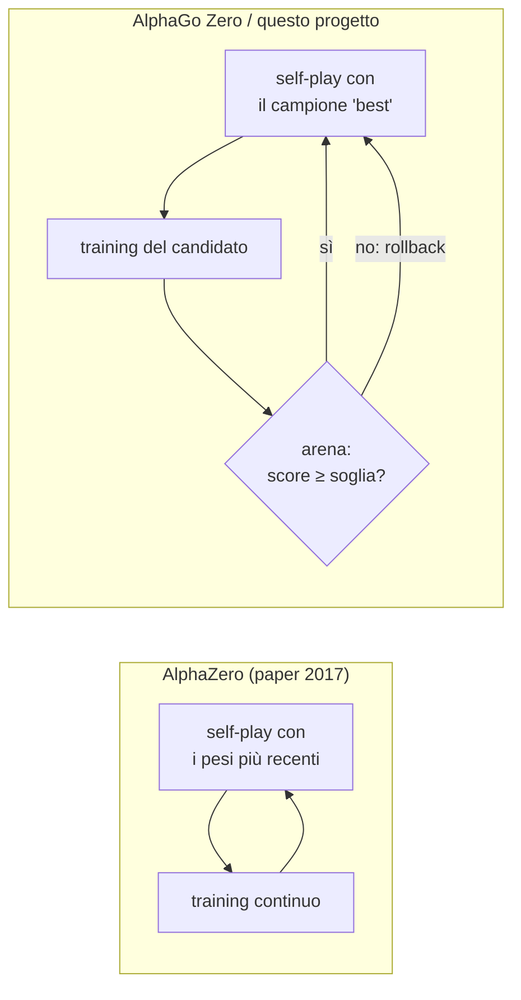

# Guida didattica: come "pensa" questo motore

Questo documento è un percorso di studio, non un riferimento tecnico come i capitoli
[03](03-codifica.md)-[06](06-apprendimento.md): parte da zero e costruisce l'intuizione
passo per passo, con diagrammi e video di supporto. Se cerchi i dettagli implementativi
esatti (nomi di file, formule complete, tabelle dei parametri) quei capitoli restano il
riferimento; qui l'obiettivo è capire **perché** il sistema è fatto così.

## 1. Il problema di partenza: l'albero è troppo grande per essere visto tutto

Negli scacchi ci sono in media **~35 mosse legali** per posizione (stima di Shannon). Se
provassi a esplorare tutte le varianti fino alla fine di una partita tipica (~40 mosse a
testa, 80 semimosse), il numero di partite possibili è la stima nota come **numero di
Shannon**: circa **10¹²⁰**. Per confronto, si stima che nell'universo osservabile ci siano
"solo" circa 10⁸⁰ atomi. Non è un problema di potenza di calcolo insufficiente — è un
problema di dimensione che nessun computer, presente o futuro, risolverà per forza bruta.



**Nessun motore scacchistico esplora questo albero per intero** — né Stockfish (che pota
aggressivamente con alpha-beta), né questo progetto. La domanda giusta non è "come
esploro tutto", è **"come scelgo bene dove guardare, sapendo che posso permettermi di
guardare solo una frazione minuscola"**.

## 2. MCTS: costruire l'albero un pezzo alla volta, dove conta

Monte Carlo Tree Search (implementato in
[`backend/app/engine/mcts.py`](../backend/app/engine/mcts.py)) non decide a priori quali
rami guardare. Li scopre **incrementalmente**, un nodo alla volta, tramite ripetute
"simulazioni". Con un budget di 96 simulazioni (il preset `small` in uso in questo
progetto), l'albero per una singola mossa avrà **al massimo ~96 nodi nuovi** — non
milioni, non miliardi. Ogni simulazione attraversa quattro fasi:



Il ciclo si ripete finché il budget di simulazioni non è esaurito. Il risultato è un
albero **sottile e sbilanciato**: profondo dove la ricerca ha trovato mosse forti,
appena accennato altrove. Non è esaustività, è **allocazione intelligente** di uno
sforzo limitato.

### Come si sceglie il ramo da esplorare: la formula PUCT

A ogni nodo, il figlio scelto è quello che massimizza:

```
score(figlio) = Q(figlio) + c_puct · P(figlio) · √(visite_padre) / (1 + visite_figlio)
```

* **Q(figlio)** — quanto è andata bene questa mossa nelle simulazioni passate
  (*sfruttamento*: "continuo a guardare quello che funziona").
* **P(figlio) · √N / (1+n)** — alto quando la rete pensa che la mossa sia buona ma è
  stata visitata poco (*esplorazione*), e decresce mano a mano che viene rivisitata.

Esempio numerico concreto: due mosse candidate alla radice, entrambe mai visitate
(`n=0`). La rete assegna prior `P=0.40` alla prima (una presa di pedone ovvia) e
`P=0.05` alla seconda (un sacrificio poco intuitivo). All'inizio la ricerca guarderà
quasi solo la prima (prior più alto = punteggio più alto). Ma se dopo alcune
simulazioni `Q` della prima mossa risulta deludente (`-0.3`, l'avversario ha una
risposta forte) mentre resta inesplorata la seconda, il termine di esplorazione della
seconda — ancora a `n=0` — torna a farla sembrare interessante, e la ricerca la prova.
Questo è il meccanismo con cui l'MCTS **corregge** l'intuizione grezza della rete senza
mai dover enumerare tutto.

📺 **Qui è dove conviene fermarsi e guardare un video**, se la meccanica di selezione/
espansione/backup non è ancora chiara sulla carta — vedi la sezione [video](#5-video-per-capire-lmcts-meglio-di-un-testo) più sotto.

## 3. Da dove viene l'"intuizione": la rete neurale

MCTS da sola, senza una guida, dovrebbe esplorare alla cieca (equivalente al Monte Carlo
classico coi rollout casuali — lento e debole). La rete neurale (
[`backend/app/engine/network.py`](../backend/app/engine/network.py)) fornisce quella
guida con due uscite per ogni posizione:

* **policy** — 4672 numeri: "quanto sembra buona, a colpo d'occhio, ciascuna mossa
  geometricamente possibile" → diventano i `prior` usati dalla formula PUCT.
* **value** — un numero in `[-1, +1]`: "chi sta vincendo qui, a colpo d'occhio" → evita
  di dover giocare una partita casuale fino alla fine solo per stimare una posizione.

La rete **non calcola linee di gioco**. È pattern-matching puro, come un giocatore che
guarda una posizione un istante e dice "mi sembra buona per il bianco". La ricerca
prende questa intuizione — spesso imprecisa — e la **raffina**.

### "Ma se la posizione non l'ha mai vista prima?"

Qui sta il punto concettuale più importante da digerire. **Non c'è nessuna tabella
posizione → mossa.** Il meccanismo è lo stesso per cui una rete che riconosce foto non
ha bisogno di aver già visto *quella specifica* foto di gatto: ha imparato caratteristiche
generali (bordi, texture, forme locali) che si ricombinano su input mai visti.

Concretamente: la rete è una CNN residuale con filtri convoluzionali **3×3** che
scorrono sulla scacchiera **con gli stessi pesi in ogni casella**. Un filtro che ha
imparato a riconoscere "cavallo che minaccia una casa vicino al re nemico" lo riconosce
in qualunque angolo della scacchiera — perché cerca un pattern *locale e relativo*, non
una posizione assoluta memorizzata.

**Ma un 3×3 è troppo piccolo per una donna che attraversa tutta la scacchiera?** Da solo
sì. Impilato, no — è il punto centrale delle CNN "a torre" (VGG-style): ogni strato 3×3
aggiunge **1 casella di raggio** a quanto "vede" indirettamente ogni cella dell'output:



Con 6 blocchi residui (12 strati convoluzionali) più lo strato di ingresso — 13 strati
totali nel preset `small` in esecuzione — il campo recettivo teorico supera la
dimensione della scacchiera **già al quarto strato**. La donna che minaccia da un lato
all'altro non è un problema per un filtro isolato: è risolto dall'impilamento, a forza
di allenamento su self-play, non da una regola scritta a mano che "traccia" la diagonale.

## 4. Il tensore: come è fatta davvero l'informazione che entra nella rete

La scacchiera non entra nella rete come FEN o come lista di pezzi: entra come un
**tensore numerico**, una pila di griglie 8×8 (chiamate "piani"), esattamente come
un'immagine RGB è una pila di 3 griglie (rosso, verde, blu) invece di un elenco di
pixel. Qui, con la storia configurata a 4 mosse (`history_length=4`), i piani sono 63.



Due tipi di piano molto diversi tra loro:

* **piani "per casella"** (pezzi): un valore indipendente in ognuna delle 64 celle —
  `1.0` dove c'è quel pezzo, `0.0` altrove.
* **piani "broadcast"** (ripetizione, costanti): **lo stesso identico numero ripetuto
  su tutte le 64 celle**. Non descrivono "dove" si trova qualcosa, descrivono un fatto
  che riguarda l'intera posizione (posso arroccare? che mossa è?) e vengono "spalmati"
  su tutta la griglia solo per avere la stessa forma degli altri piani — così ogni
  filtro convoluzionale locale, in ogni punto della scacchiera, ha comunque accesso a
  quel fatto globale mentre guarda i pezzi vicini.

Esempio reale, posizione iniziale (piano 0 = pedoni del mover, piano 5 = re del mover):

```
piano 0 (pedoni bianchi)      piano 5 (re bianco)         piano costante "posso
                                                            arroccare corto?" (broadcast)
. . . . . . . .               . . . . . . . .              1 1 1 1 1 1 1 1
. . . . . . . .               . . . . . . . .              1 1 1 1 1 1 1 1
. . . . . . . .               . . . . . . . .              1 1 1 1 1 1 1 1
. . . . . . . .               . . . . . . . .              1 1 1 1 1 1 1 1
. . . . . . . .               . . . . . . . .              1 1 1 1 1 1 1 1
. . . . . . . .               . . . . . . . .              1 1 1 1 1 1 1 1
1 1 1 1 1 1 1 1               . . . . . . . .              1 1 1 1 1 1 1 1
. . . . . . . .               . . . . 1 . . .              1 1 1 1 1 1 1 1
```

Un dettaglio che sorprende sempre: **l'en passant non ha un piano dedicato**. La sua
legalità è comunque garantita — è gestita interamente fuori dalla rete, da
`python-chess`, che genera la lista di mosse davvero legali e la passa alla ricerca
(`legal_move_indices` in
[`encoding.py`](../backend/app/engine/encoding.py)). La rete può quindi *giocarla*
sempre correttamente, ma la sua intuizione su *quanto sia una buona idea* è più debole
che per un'implementazione con un piano ep dedicato (es. Leela Chess Zero), perché deve
dedurla indirettamente confrontando gli step di storia invece di leggerla da un flag
esplicito.

Un altro dettaglio importante per l'orientamento: quando tocca al Nero, la scacchiera
viene **ribaltata verticalmente e i colori scambiati**, così i piani 0-5 sono sempre "i
miei pezzi" indipendentemente dal colore reale. La rete impara **una sola cosa** — come
giocare da chi muove — invece di due copie separate della stessa conoscenza.

## 5. Il ciclo di apprendimento: nessun maestro esterno

Qui MCTS e rete si richiudono in un anello. Non c'è nessun dataset di partite umane, né
Stockfish nel training (vedi [l'invarianza documentata](08-isolamento-stockfish.md)):
tutto nasce dal gioco della rete contro sé stessa.



Il punto concettuale chiave: la **distribuzione delle visite π** prodotta da MCTS
(quante volte ogni mossa è stata scelta durante la ricerca) è quasi sempre **più
accurata** del prior grezzo della rete che l'ha generata, perché include la correzione
della ricerca — i rami deboli sono stati esplorati e scartati. Allenare la policy a
imitare π significa insegnare alla rete **ciò che la ricerca stessa ha scoperto**: è
distillazione ricorsiva, senza bisogno di nessun giudice esterno. Il ciclo completo, con
tutte le formule di loss e i dettagli del buffer, è in [06-apprendimento.md](06-apprendimento.md).

## 6. Quanto assomiglia al vero AlphaZero — e dove differisce

L'algoritmo — MCTS+PUCT, rete a due teste, self-play, encoding a piani — è una replica
fedele delle scelte progettuali del paper *Mastering Chess and Shogi by Self-Play with a
General Reinforcement Learning Algorithm* (Silver et al., 2017). Le differenze sono
soprattutto di **scala** e una scelta architetturale specifica sul gating.

| aspetto | AlphaZero (paper) | questo progetto |
|---|---|---|
| encoding input | 14×T + 7 piani | identico |
| encoding mosse | 4672 (73 piani × 64 caselle) | identico |
| rete | 20 o 40 blocchi × 256 filtri (decine di milioni di parametri) | preset `small`: 6 blocchi × 96 filtri (1,4 M parametri) |
| simulazioni MCTS/mossa | 800 | 32-400 a seconda del preset |
| scala self-play | milioni di partite, migliaia di TPU | centinaia/migliaia di partite, CPU di un PC |
| rumore Dirichlet (scacchi) | α = 0,3 | α = 0,3 (identico) |

La differenza concettuale più interessante riguarda la **fase 4** del diagramma sopra —
il gate arena:



Il paper AlphaZero (a differenza del suo predecessore AlphaGo Zero) **elimina** la
verifica in arena: aggiorna sempre la rete più recente e la usa subito per il self-play
successivo, senza mai controllarla contro la precedente. Questo progetto ha invece
**reintrodotto** il gate di AlphaGo Zero (soglia 0,55, [`train.py`](../backend/app/engine/train.py)) — quindi
su questo punto specifico segue il design più vecchio, non quello del paper citato nei
suoi stessi commenti. Non è un errore: è una scelta esplicita per rendere il progresso
monotono (vedi la tabella "problemi tipici" in [06-apprendimento.md](06-apprendimento.md)),
ma vale la pena saperlo, perché cambia la dinamica di come la forza si accumula
iterazione dopo iterazione.

### Un caso di studio reale, letto dal database di questo progetto

Non serve immaginare: si può leggere l'effetto del gate direttamente nei dati di un run
in corso. Interrogando `backend/data/training.db` per un run attivo di preset `small` è
emerso questo pattern, iterazione dopo iterazione: la prima promozione avviene subito
(`arena_score 0,65`), poi per oltre venti iterazioni consecutive il candidato oscilla
attorno a `0,42-0,53` — sempre sotto la soglia di 0,55 — e viene respinto quasi ogni
volta. L'Elo mostrato in dashboard resta congelato al valore della prima promozione,
perché quel numero si aggiorna solo quando l'arena conferma un miglioramento, non ad
ogni iterazione.

Due letture possibili, entrambe vere in parte:

1. **Scala insufficiente** (atteso, non un bug): con poche centinaia di partite di
   self-play il gioco è ancora debole, e un margine di miglioramento reale può essere
   troppo piccolo per emergere chiaramente su un campione di sole 20 partite arena.
2. **Rumore statistico della soglia**: con `arena.games=20` e `win_threshold=0,55`,
   serve un margine netto per essere confermato — punteggi tra 0,42 e 0,53 sono
   compatibili con "forza quasi identica al campione", non necessariamente con un vero
   arretramento.

Questo è esattamente il tipo di lettura che la dashboard KPI (
[07-kpi.md](07-kpi.md)) è pensata per permettere: non fidarsi di un solo numero (l'Elo),
ma incrociarlo con `arena_score`, `policy_loss`/`value_loss` (che possono continuare a
scendere anche quando l'Elo è fermo) e `draw_rate`.

## 7. Video per capire l'MCTS meglio di un testo

Un testo statico fatica a rendere il "ramificarsi ed esplorare" della ricerca. Questi
video, in ordine di difficoltà crescente, coprono il buco che un documento scritto lascia
sempre su un algoritmo intrinsecamente dinamico:

1. **[Monte Carlo Tree Search - Computerphile](https://www.youtube.com/watch?v=BEFY7IHs0HM)**
   — la spiegazione più intuitiva e visiva, buon primo passo per capire cosa sono le
   quattro fasi (selezione, espansione, valutazione/simulazione, backup) prima di
   vederle nel codice di questo progetto.
2. **[Monte Carlo Tree Search (MCTS) explained with a detailed example](https://www.youtube.com/watch?v=reoP5usaYU4)**
   — segue un esempio numerico passo-passo su un albero piccolo, utile per vedere "a
   mano" come cambiano i contatori di visite e i valori medi ad ogni simulazione.
3. **[Monte Carlo Tree Search — John Levine](https://www.youtube.com/watch?v=UXW2yZndl7U)**
   — lezione universitaria più lunga e rigorosa, la più citata online per chi vuole la
   versione completa con le formule (UCB1, la base storica di PUCT).
4. **[AlphaZero: DeepMind's New Chess AI — Two Minute Papers](https://www.youtube.com/watch?v=2ciR6rA85tg)**
   — panoramica breve e divulgativa su cosa AlphaZero ha dimostrato, utile per
   contestualizzare *perché* questo progetto è costruito come descritto nella sezione 6.
5. **[AlphaZero from Scratch – Machine Learning Tutorial](https://www.youtube.com/watch?v=wuSQpLinRB4)**
   — per chi vuole vedere l'intero sistema (rete + MCTS + self-play) costruito riga per
   riga in Python; è il livello di dettaglio più vicino a leggere direttamente
   [`mcts.py`](../backend/app/engine/mcts.py) e [`train.py`](../backend/app/engine/train.py) di questo repository.

## Per approfondire nella documentazione di questo progetto

* [03 — Codifica](03-codifica.md): ogni piano e ogni indice di mossa, con tutti i dettagli.
* [04 — Rete neurale](04-rete-neurale.md): architettura completa, dimensioni dei preset, Squeeze-Excitation.
* [05 — Ricerca MCTS](05-ricerca-mcts.md): formule complete, virtual loss, nodi terminali.
* [06 — Apprendimento](06-apprendimento.md): il ciclo di training in dettaglio, checkpoint, ripresa di un run.
* [07 — KPI](07-kpi.md): come leggere la dashboard mentre un run è in corso.
